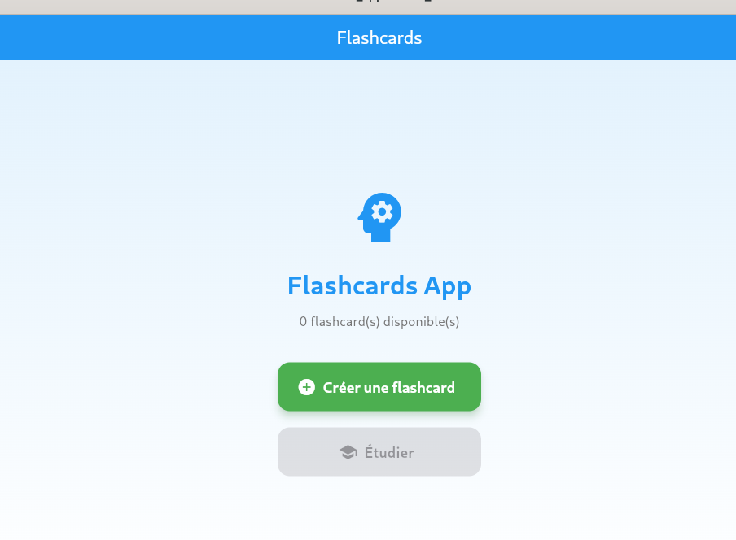
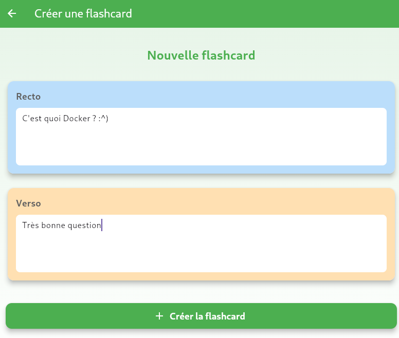
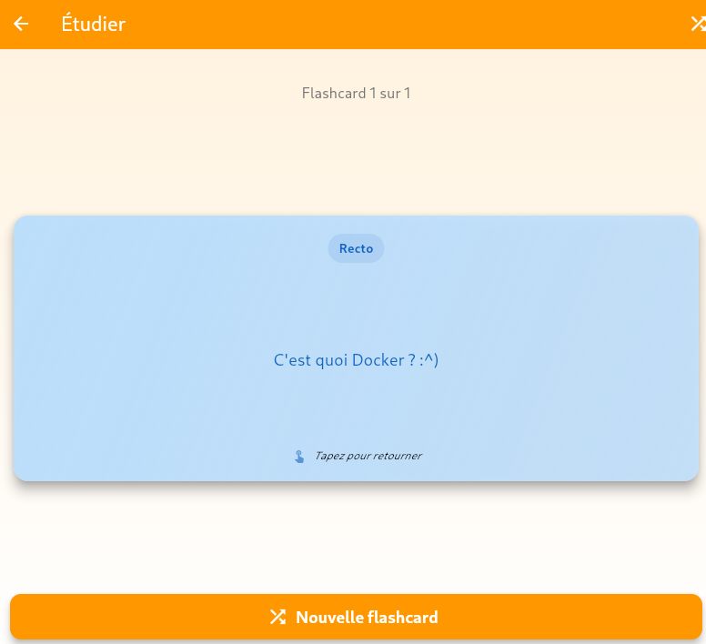

# Rendu Flutter DHIMENE ISMAEL ESGI2

## Le repo est là :
https://github.com/Nuzzload/flutter_application_2

## Avertissement : Syntaxe Flutter, usage de LLM et le projet dans l'ensemble
Je tiens à préfacer le reste de ce dossier par un petit état des lieux. Je n'aime pas Flutter et sa syntaxe. Imbriquer des éléments à l'infini n'est pas une expérience plaisante, et s'y retrouver après coup est encore pire. Je SAIS maintenant que je peux me débrouiller pour fournir quelque chose de correct et de fonctionnelle, mais naviguer mon code sans aide de mise en page et avoir l'impression de devenir fou à repasser sur le même bloc 18 fois en se demandant quelle parenthèse est en fait de trop ou pour laquelle il semble manquer une jumelle n'est pas quelque chose que je compte expériencer de nouveau dans un futur proche.

J'ai bel et bien pris avantage des LLM dans la mise en place du projet, principalement GPT et Claude. Je les ai utilisées pour m'aider à mettre en page le code et réaliser les widgets dans la mesure du possible, autour d'une structure *relativement* organisé. Claude semble être bien plus performant que GPT en Flutter. Le résultat observable du projet est le résultat de ma mise en forme et ma vision.

J'avais à l'origine pour plan de réaliser un clicker inversé, où l'objectif était de réduire son score à 0 le plus vite possible, sur fond d'extinction de l'humanité à la [Plague Inc](https://fr.wikipedia.org/wiki/Plague_Inc.). Cependant, après avoir pris un peu de recul sur le projet et avoir réalisé que pour mon déplaisir à l'usage du langage, j'ai préféré bifurqué sur une application qui me semblait plus à mesure de prendre forme sans passer une durée de temps abusive en compagnie de Flutter. Inspiré par [Anki](https://fr.wikipedia.org/wiki/Anki), j'ai décidé de réaliser une application de flashcard à l'ambition modeste (pas de mémoire long terme et pas d'algorithme d'apprentissage).

## Le projet en l'état

Le projet dans son état actuel est donc une application permettant la création de flashcard, avec éléments recto et verso, et le chargement aléatoire de flashcard dans le but de repasser dessus. 

### On observe 3 pages qui fonctionnent en relation les unes avec les autres : 
1. L'écran d'accueil permet de naviguer entre les 2 autres et affiche le nombre de flashcard actuellement en existence. 

2. L'écran de création de flashcard permet de créer des flashcard et de les ajouter à la pool général. Il est nécessaire de fournir un texte recto et un texte verso avant de pouvoir valider l'ajout.

3. L'écran d'étude, où l'on fait s'afficher les flashcards aléatoirement. On ne peut y accéder uniquement à partir du moment où des flashcards existent. On peut passer à la suivante en appuyant sur le bouton en bas de l'écran, et retourner la carte en cliquant dessus.

J'ai préféré passer outre la mémoire long-terme et l'algorithme d'affichage (normalement les flashcards s'affichent dans une logique de répétition en fonction des résultats de l'apprenant). L'important est que 3 pages existent, elles communiquent des données entre elles et sont visuellement cohérentes.

## Conclusion
Le projet est fonctionnel, le code pourrait sûrement être plus élégant mais je suis satisfait du résultat actuel. J'ai pu éviter le monolithe et les pages ressemblent à quelque chose.

On pourrait s'imaginer intégrer un système de stockage des flashcards, la possibilité de les exporter pour les partager avec d'autres utilisateurs. Il est également intéressant de regarder les algorithmes de répétition qui permettent de soumettre les flashcards intelligemments

## Remerciements :
Elodie, pour l'inspiration initiale avec Anki

Gianni, pour la ligne de commande permettant de cacher la bannière de debug

Benjamin, pour le conseils de debug et les explications sur la structure du projet

